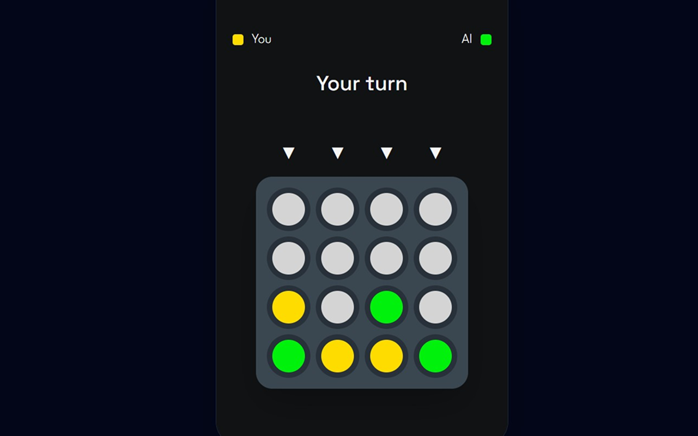

# Connect 3

<p align="center">
  
  
  
</p>

A mobile-first implementation of the classic **Connect 3** game featuring an intelligent AI opponent powered by the **Minimax algorithm** and a **Decision Tree**.

The application consists of a React frontend and a FastAPI backend. The AI evaluates possible game states using Minimax search and selects the optimal move based on the configured search depth.

# Technologies

## Frontend

- React
- TypeScript
- Tailwind CSS
- React Context API
- React Router
- Axios
- Vite

## Backend

- Python
- FastAPI
- Pydantic
- Uvicorn
- CORS Middleware

# Artificial Intelligence

The computer opponent is implemented using the **Minimax algorithm**.

Instead of choosing random moves, the AI explores possible future game states by constructing a **Decision Tree**.

Each node in the tree represents:

- the current board configuration
- the active player
- possible legal moves
- evaluated score

The Minimax algorithm recursively evaluates terminal and intermediate positions to determine the optimal move while assuming perfect play from both players.

The search depth is configurable through three difficulty levels:

| Difficulty | Search Depth |
| ---------- | ------------ |
| Easy       | 4            |
| Medium     | 6            |
| Hard       | 8            |

Increasing the search depth allows the AI to evaluate more future game states, producing stronger gameplay at the cost of additional computation.

# Application Flow

1. The user selects the desired AI difficulty.
2. A new game is created by the FastAPI backend.
3. The player makes a move.
4. The backend validates the move.
5. The AI evaluates the current position using Minimax.
6. The optimal move is returned to the frontend.
7. The board updates in real time until a winner or draw is reached.

# Running the Project

## Backend

```bash
pip install -r requirements.txt

uvicorn main:app --reload
```

## Frontend

```bash
npm install

npm run dev
```
